# Eleven95.TruckBites

TruckBites is a distributed application built with modern .NET technologies, featuring a Blazor frontend, a robust Web API backend backed by MySQL, and an architecture ready for future mobile extensions.

## 📂 Project Overview

The solution is organized into the following micro-components:

| Project | Description | Framework |
| :--- | :--- | :--- |
| **Eleven95.TruckBites.WebApp** | The user-facing Blazor application (Interactive Server/WASM). Acts as the primary web portal. | .NET 10 |
| **Eleven95.TruckBites.WebApp.Client** | Blazor WebAssembly components. Runs in the browser and is designed to be shared with the future Blazor Hybrid mobile app. | .NET 10 |
| **Eleven95.TruckBites.WebApi** | The core backend REST API. Handles data processing, authentication (JWT), and database management. Serves both the WebApp and future Mobile clients. | .NET 9 |
| **Eleven95.TruckBites.Data** | Data Access Layer using Entity Framework Core. Contains database context and migrations. | .NET Standard/Core |
| **Eleven95.TruckBites.Services** | Business logic layer shared by the API and application. | .NET Standard/Core |

---

## 🚀 Run Locally

The easiest way to run the entire stack locally is using Docker Compose. This orchestrates the Database, API, and Frontend containers automatically.

### Prerequisites
*   Docker Desktop installed and running.
*   .NET SDK (9.0+) installed (optional, for local IDE debugging).

### Steps

1.  **Clone the repository** and navigate to the solution root.
2.  **Build and Start**:
    Run the following command in your terminal:
    ```bash
    docker-compose up --build
    ```
3.  **Access the Application**:
    *   **Web App (Frontend):** [http://localhost:8082](http://localhost:8082)
    *   **Web API (Swagger):** [http://localhost:8080/swagger](http://localhost:8080/swagger)
    *   **MySQL Database:** Port `3306`

### Configuration Notes
*   **Database Credentials:** The compose file pre-configures the database user as `truckbites_user` with password `truckbites_password`.
*   **JWT Settings:** Development keys and issuers are configured in `appsettings.json`.
    *   *Security Warning:* The default `SecretKey` (ending in `...1B60`) is for development only. **Do not** use this key in production environments.
    *   The default Issuer/Audience is configured to `https://truckbites.eleven95.co`.

---

## ☁️ Deployment Strategies

Since the API must support both the Web App and a future Blazor Hybrid mobile app, the strategies below focus on exposing **both** services securely.

### 1. Azure (Recommended)
Since this is a .NET stack, Azure offers the most seamless integration.

*   **Compute:** **Azure Container Apps (ACA)**.
    *   Deploy `WebApp` and `WebApi` as separate Container Apps within the same Environment.
*   **Database:** **Azure Database for MySQL (Flexible Server)**.
*   **Registry:** **Azure Container Registry (ACR)**.
*   **Networking:**
    *   **WebApi:** Enable **Ingress: External**. This provides a public HTTPS endpoint (e.g., `https://api.truckbites...`) that your Mobile App can reach directly.
    *   **WebApp:** Enable **Ingress: External** for the browser-based users.
    *   *Pro Tip:* Consider placing **Azure API Management** in front of the WebApi later to handle throttling and API keys for the mobile app.

### 2. AWS (Amazon Web Services)
AWS offers robust container options with granular control over public routing.

*   **Compute:** **Amazon ECS (Elastic Container Service) with Fargate**.
    *   Run the containers in a Fargate cluster.
*   **Database:** **Amazon RDS for MySQL**.
*   **Networking:**
    *   Use an **Application Load Balancer (ALB)** acting as the single entry point.
    *   **Routing:** Configure Listener Rules to route traffic based on hostname or path:
        *   `api.truckbites.com` → Forwards to `WebApi` Target Group.
        *   `app.truckbites.com` → Forwards to `WebApp` Target Group.

### 3. Google Cloud Platform (GCP)
GCP provides a developer-friendly "serverless container" experience where every service gets a URL by default.

*   **Compute:** **Google Cloud Run**.
    *   Deploy two separate Cloud Run services: `truckbites-api` and `truckbites-web`.
*   **Database:** **Cloud SQL for MySQL**.
*   **Networking:**
    *   **WebApi:** Set "Allow unauthenticated invocations" (public) so the Mobile App can reach the login endpoints. Secure the data endpoints using the JWT tokens generated by your auth logic.
    *   **Custom Domains:** Map your custom domains easily using the Cloud Run "Manage Custom Domains" integration.

---

## 🛠 Development

To work on the code without Docker:

1.  Ensure you have a local MySQL instance running (connection string in `appsettings.Development.json`).
2.  Open `Eleven95.TruckBites.sln` in **JetBrains Rider**.
3.  Set multiple startup projects (WebApi + WebApp) and press Run.

## Architecture

```mermaid
graph TD
%% Actors
    UserWeb([👤 Web User])
UserMobile(["📱 Mobile User<br>(Future Blazor Hybrid)"])

%% Subgraph for the Solution
subgraph "Eleven95.TruckBites Solution"
direction TB

%% Frontend
subgraph "Frontend Layer"
WebApp["💻 WebApp Container<br>(.NET 10 Blazor Server/WASM)"]
end

%% Backend
subgraph "Backend Layer"
WebApi["⚙️ WebApi Container<br>(.NET 9 REST API)"]
end

%% Data
subgraph "Data Layer"
DB[("🗄️ MySQL Database")]
end
end

%% Relationships
UserWeb -->|HTTPS / Browser| WebApp
UserMobile -->|HTTPS / JSON| WebApi

WebApp -->|YARP Reverse Proxy 
Acts as a BackendForFrontend
and Reverse Proxy for connecting
to the API from Web Client| WebApi
WebApi -->|EF Core / TCP| DB

%% Styling
classDef container fill:#e1f5fe,stroke:#01579b,stroke-width:2px;
classDef db fill:#fff9c4,stroke:#fbc02d,stroke-width:2px;
classDef actor fill:#f3e5f5,stroke:#7b1fa2,stroke-width:2px;

class WebApp,WebApi container;
class DB db;
class UserWeb,UserMobile actor;
```

