# Eleven95.TruckBites

TruckBites is a distributed, multi-tenant platform built with modern .NET technologies, featuring separate Blazor frontends for customers and vendors, robust Web API backends backed by MySQL, and a microservices-ready architecture.

## 📂 Project Overview

The solution is organized into the following components:

### Core Services
| Project | Description | Framework |
| :--- | :--- | :--- |
| **Eleven95.TruckBites.WebApi** | Customer-facing REST API. Handles customer data, orders, authentication (JWT), and database operations. | .NET 9 |
| **Eleven95.TruckBites.Vendor.WebApi** | Vendor-facing REST API. Manages vendor operations, food truck management, and order fulfillment. | .NET 9 |

### Frontend Applications
| Project | Description | Framework |
| :--- | :--- | :--- |
| **Eleven95.TruckBites.WebApp** | Customer-facing Blazor application with Server/WASM hybrid mode. Acts as a Backend-for-Frontend (BFF) for the customer API. | .NET 10 |
| **Eleven95.TruckBites.WebApp.Client** | Blazor WebAssembly components for customers. Shared with potential hybrid mobile apps. | .NET 10 |
| **Eleven95.TruckBites.Vendor.WebApp** | Vendor-facing Blazor application with Server/WASM hybrid mode. Acts as a Backend-for-Frontend (BFF) for the vendor API. | .NET 10 |
| **Eleven95.TruckBites.Vendor.WebApp.Client** | Blazor WebAssembly components for vendors. | .NET 10 |

### Data & Infrastructure
| Project | Description | Framework |
| :--- | :--- | :--- |
| **Eleven95.TruckBites.Data** | Database context and entity models. Contains all DbContext and EF Core entity definitions. | .NET Standard |
| **Eleven95.TruckBites.EF** | Entity Framework Core orchestration project. Manages database migrations and schema updates. | .NET 9 |
| **Eleven95.TruckBites.Services** | Service interfaces defining contracts for business logic. Each API implements the required interfaces based on its specific needs. | .NET Standard |
| **Eleven95.TruckBites.Client.Shared** | Shared client-side logic and utilities (HTTP extensions, helpers). Used by both Blazor WebAssembly projects. | .NET Standard |
| **Eleven95.TruckBites.Server.Shared** | Shared server-side logic and utilities (authentication handlers, common services). Used by both APIs and web apps. | .NET Standard |


## Architecture

```mermaid
graph TD
%% Actors
    UserCustomer([👤 Customer Web User])
UserVendor([👨‍🍳 Vendor Web User])
UserMobile(["📱 Mobile User<br>(Future Blazor Hybrid)"])

%% Subgraph for the Solution
subgraph "Eleven95.TruckBites Solution"
direction TB

%% Frontend Layer
subgraph "Customer Frontend"
CustomerWebApp["💻 Customer WebApp<br>(.NET 10 Blazor Server/WASM)"]
end

subgraph "Vendor Frontend"
VendorWebApp["📋 Vendor WebApp<br>(.NET 10 Blazor Server/WASM)"]
end

%% Backend Layer
subgraph "Backend APIs"
CustomerApi["⚙️ Customer WebApi<br>(.NET 9 REST API)"]
VendorApi["⚙️ Vendor WebApi<br>(.NET 9 REST API)"]
end

%% External Auth
subgraph "External Services"
Auth0["🔐 Auth0<br>(Identity & SSO)"]
end

%% Data
subgraph "Data Layer"
DB[("🗄️ MySQL Database<br>(Shared Multi-Tenant)")]
EF["🔗 Entity Framework Core<br>(Migrations & Context)"]
end

%% Business Logic
subgraph "Shared Logic"
Services["📦 Services Layer<br>(Business Logic)"]
end
end

%% Relationships
UserCustomer -->|HTTPS / Browser| CustomerWebApp
UserVendor -->|HTTPS / Browser| VendorWebApp
UserMobile -->|HTTPS / JSON| CustomerApi

CustomerWebApp -->|HTTP / YARP Proxy| CustomerApi
VendorWebApp -->|HTTP / YARP Proxy| VendorApi

CustomerWebApp -->|OAuth2/OIDC| Auth0
VendorWebApp -->|OAuth2/OIDC| Auth0

CustomerApi -->|JWT Verification| Services
VendorApi -->|JWT Verification| Services
Services -->|EF Core| EF
EF -->|TCP / Migrations| DB

%% Styling
classDef container fill:#e1f5fe,stroke:#01579b,stroke-width:2px;
classDef db fill:#fff9c4,stroke:#fbc02d,stroke-width:2px;
classDef actor fill:#f3e5f5,stroke:#7b1fa2,stroke-width:2px;
classDef service fill:#c8e6c9,stroke:#2e7d32,stroke-width:2px;

class CustomerWebApp,VendorWebApp,CustomerApi,VendorApi container;
class DB,EF db;
class UserCustomer,UserVendor,UserMobile actor;
class Services service;
```



## 🚀 Run Locally

The easiest way to run the entire stack locally is using Docker Compose. This orchestrates the Database, both Customer and Vendor APIs, and both frontend applications automatically.

### Prerequisites
*   Docker Desktop installed and running.
*   .NET SDK (9.0+) installed (optional, for local IDE debugging).
*   Environment variables configured (see Configuration Notes below).

### Steps

1.  **Clone the repository** and navigate to the solution root.
2.  **Configure environment variables**:
    Create a `.env` file (or use existing one) with required settings:
    ```env
    MYSQL_ROOT_PASSWORD=root_password
    MYSQL_DATABASE=truckbites
    MYSQL_USER=truckbites_user
    MYSQL_PASSWORD=truckbites_password
    DB_ROOT_CONNECTION_STRING=Server=mysql;Database=truckbites;User=root;Password=root_password;
    DB_APP_CONNECTION_STRING=Server=mysql;Database=truckbites;User=truckbites_user;Password=truckbites_password;
    CUSTOMER_WEBAPI_JWT_SETTINGS_AUTHORITY=https://localhost:5001
    CUSTOMER_WEBAPI_JWT_SETTINGS_AUDIENCE=https://localhost:5001
    VENDOR_WEBAPI_JWT_SETTINGS_AUTHORITY=https://localhost:5002
    VENDOR_WEBAPI_JWT_SETTINGS_AUDIENCE=https://localhost:5002
    CUSTOMER_WEBAPP_AUTH0_DOMAIN=your-auth0-domain.auth0.com
    CUSTOMER_WEBAPP_AUTH0_CLIENT_ID=your_customer_client_id
    CUSTOMER_WEBAPP_AUTH0_AUDIENCE=your_customer_audience
    CUSTOMER_WEBAPP_AUTH0_CLIENT_SECRET=your_customer_client_secret
    VENDOR_WEBAPP_AUTH0_DOMAIN=your-auth0-domain.auth0.com
    VENDOR_WEBAPP_AUTH0_CLIENT_ID=your_vendor_client_id
    VENDOR_WEBAPP_AUTH0_AUDIENCE=your_vendor_audience
    VENDOR_WEBAPP_AUTH0_CLIENT_SECRET=your_vendor_client_secret
    ```

3.  **Build and Start**:
    Run the following command in your terminal:
    ```bash
    docker-compose up --build
    ```

4.  **Access the Applications**:
    *   **Customer Web App (Frontend):** [http://localhost:8080](http://localhost:8080)
    *   **Vendor Web App (Frontend):** [http://localhost:8081](http://localhost:8081)
    *   **phpMyAdmin (Database):** [http://localhost:8082](http://localhost:8082)
    *   **MySQL Database:** Port `3306`

### Configuration Notes
*   **Database Credentials:** The compose file pre-configures the database with user `truckbites_user` and password `truckbites_password`.
*   **Auth0 Integration:** Both Customer and Vendor apps use Auth0 for authentication. JWT tokens are issued by Auth0 and validated by the APIs. Configure your Auth0 tenant details in the environment variables above.
*   **Backend-for-Frontend (BFF) Pattern:** Both web applications implement the BFF pattern using YARP reverse proxy. This provides a secure boundary between the client and the backend APIs, handling authentication, CORS, and request routing.

---

## 🛠 Development

### Option 1: Docker Compose (Recommended for Local Development)
The easiest way to run the entire stack locally is using Docker Compose.

**Steps:**
1.  Ensure Docker Desktop is installed and running.
2.  Configure environment variables in a `.env` file (see Run Locally section above).
3.  Run:
    ```bash
    docker-compose up --build
    ```
4.  Access the applications at the URLs listed in the Run Locally section.

### Option 2: Minikube (Local Kubernetes Cluster)
For testing Kubernetes deployments locally, use Minikube.

**Prerequisites:**
*   Minikube installed and running.
*   kubectl configured to use Minikube.
*   Docker installed (Minikube uses Docker driver).

**Steps:**
1.  Start Minikube:
    ```bash
    minikube start --driver=docker
    ```
2.  Run the deployment script (PowerShell on Windows):
    ```powershell
    .\deployment\k8s_deploy.ps1
    ```

    This script will:
    - Build all Docker images (Customer/Vendor APIs, WebApps, and EF migrations)
    - Load images into Minikube
    - Apply Kubernetes configuration from `deployment/2_deploy.yml`
    - Restart pods to load new images

3.  Access services via Minikube tunnel:
    ```bash
    minikube tunnel
    ```

    Then access the applications at the same URLs as Docker Compose (localhost:8080 for Customer, localhost:8081 for Vendor).

### Option 3: Manual Local Setup
If you prefer to run services individually without containers:

1.  **Install MySQL locally** (or use a cloud MySQL instance).
2.  **Update connection strings** in `appsettings.Development.json` for each project:
    ```json
    {
      "ConnectionStrings": {
        "DefaultConnection": "Server=localhost;Database=truckbites;User=root;Password=password;"
      }
    }
    ```
3.  **Run database migrations**:
    ```bash
    cd Eleven95.TruckBites.EF
    dotnet ef database update
    ```
4.  **Run multiple startup projects** in your IDE (JetBrains Rider or Visual Studio):
    *   `Eleven95.TruckBites.WebApi` (port 5000)
    *   `Eleven95.TruckBites.WebApp` (port 5001)
    *   `Eleven95.TruckBites.Vendor.WebApi` (port 5002)
    *   `Eleven95.TruckBites.Vendor.WebApp` (port 5003)

### Shared Code Organization
*   **Eleven95.TruckBites.Services**: Contains service interfaces only. Implementation is done per-project based on specific requirements.
*   **Eleven95.TruckBites.Server.Shared**: Contains shared server-side logic used by APIs and web applications (authentication handlers, common utilities, middleware).
*   **Eleven95.TruckBites.Client.Shared**: Contains shared client-side logic used by both Blazor WebAssembly projects (HTTP client extensions, utilities, helpers).

## 🔐 Authentication & Authorization

*   **Auth0:** Primary identity provider for both customer and vendor applications. Handles user authentication, SSO, and JWT token generation.
*   **OAuth2 / OpenID Connect:** Both web applications use OAuth2/OIDC flow to authenticate with Auth0.
*   **JWT Bearer Tokens:** APIs validate JWT tokens from Auth0 for API requests.
*   **BFF Pattern:** Use to protect the internal API and encrypt the JWT token using secure server cookies
## 🚨 Security Best Practices

1.  **Never commit secrets** - Use `dotnet user-secrets` or environment variables.
3.  **Database Credentials** - Use managed identities or secret managers (Azure Key Vault, AWS Secrets Manager).
5.  **HTTPS Only** - Enforce in production environments.
6.  **Database Backups** - Implement automated backups for production databases.

## 📄 License

This project is proprietary software. All rights reserved.